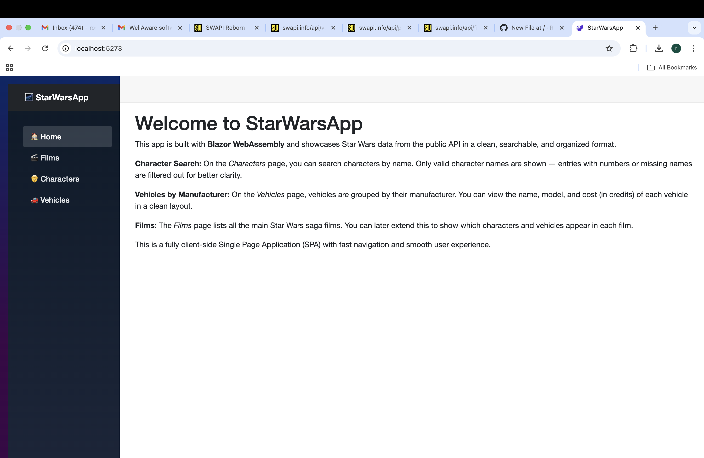

# Star Wars Explorer - Blazor WebAssembly App

This is a Blazor WebAssembly single-page application (SPA) built using data from the Star Wars API (https://swapi.info/). The app allows users to explore Star Wars films, characters, and vehicles in a clean and interactive UI.

---

## Features

- **Films Section**: View a list of Star Wars films. Clicking a film shows more details, including characters and vehicles that appeared in the film.
- **Characters Section**: Search characters by name. Only names without numbers are displayed.
- **Vehicles Section**: Vehicles are grouped by manufacturer, and each entry displays the name and cost (if known).
- **Navigation**: A sidebar allows seamless navigation between Home, Films, Characters, and Vehicles.
- **Responsive UI**: Works on both desktop and mobile devices.

---

## Screenshots and Explanation

### Home Page
The landing screen of the app with a modern sidebar layout.



---

### 🎬 Films Page

#### Before Expanding
Displays a simple list of Star Wars films.


#### After Expanding
Clicking a film reveals its director, producer, characters, and vehicles.


---

### Characters Page

#### Before Filtering
All character names are loaded initially from the API.


#### After Filtering Valid Names
Only names without numbers are shown. Users can also search using the input box.


---

### Vehicles Page

Vehicles are grouped by manufacturer, and each list displays the model name along with its cost (if available).


---

## Tech Stack

- Blazor WebAssembly (.NET 8)
- C#
- REST API Integration using HttpClient
- Bootstrap (custom styling)
- Responsive CSS Grid Layout

---

## Project Setup

To run locally:

```bash
git clone https://github.com/RoshiniNwmsu/StarWarsApp.git
cd StarWarsApp
dotnet run
```

Make sure you have the [.NET 8 SDK](https://dotnet.microsoft.com/en-us/download/dotnet/8.0) installed.

---


